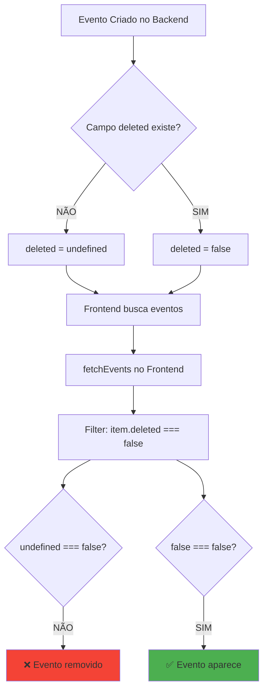

# 🔍 Investigação do Bug - Eventos Não Aparecem no Frontend

## 🐛 Problema Identificado

**CAUSA RAIZ ENCONTRADA:** O mesmo bug que estava no backend existe no frontend!

### Sintoma
Eventos não aparecem na interface web, mesmo após serem criados com sucesso no Firebase.

### Causa do Problema

## 📊 Comparação Entre Módulos

### ❌ Módulo de EVENTOS (`src/components/getters/events.js`)

**Linha 140:**
```javascript
events = events.filter((item) => item.deleted === false);
```

**Problema:** 
- Usa comparação ESTRITA (`===`)
- Se o campo `deleted` não existir no documento:
  - `item.deleted` retorna `undefined`
  - `undefined === false` retorna `false`
  - **Evento é REMOVIDO do array**

### ✅ Módulo de LOCAIS (`src/components/getters/local.js`)

**Linha 84:**
```javascript
locals = locals.filter((item) => !item.deleted);
```

**Por que funciona:**
- Usa negação lógica (`!`)
- Se o campo `deleted` não existir no documento:
  - `item.deleted` retorna `undefined`
  - `!undefined` retorna `true`
  - **Local APARECE na lista**

## 🔄 Fluxo do Problema



## 📋 Análise Detalhada

### 1. Função `fetchEvents()` - Linha 123-147

```javascript
export const fetchEvents = async () => {
    if (sessionStorage.getItem('events')) {
        return JSON.parse(sessionStorage.getItem('events'))  // Cache pode perpetuar o problema!
    }
    try {
        const today = firebase.firestore.Timestamp.fromDate(new Date());
        const snapshot = await firebase.firestore()
            .collection('evento')
            .where('data', '>=', today)
            .get()
        let events = snapshot.docs.map(doc => {
            return {
                ...doc.data(),
                id: doc.id
            };
        });
        // PROBLEMA AQUI: Filtra eventos onde deleted === false
        events = events.filter((item) => item.deleted === false);  // ❌ LINHA 140
        events = shuffleArray(events);
        sessionStorage.setItem('events', JSON.stringify(events))
        return events;
    } catch (error) {
        return []
    }
}
```

### 2. Todas as funções afetadas

Funções que dependem de `fetchEvents()` e são impactadas:
- `getTopEvents()` - Linha 72-81
- `getPopularEvents()` - Linha 83-92
- `getAllEvents()` - Linha 94-103

Todas essas funções:
1. Chamam `fetchEvents()`
2. Recebem array já filtrado (sem eventos com `deleted` undefined)
3. Aplicam filtros adicionais
4. Armazenam em cache

## 🎯 Por Que o Bug Persiste Após Correção no Backend?

### 1. **Cache no SessionStorage**
```javascript
if (sessionStorage.getItem('events')) {
    return JSON.parse(sessionStorage.getItem('events'))
}
```
- Eventos já filtrados incorretamente ficam em cache
- Novos eventos criados após correção no backend ainda não aparecem
- Cache precisa ser limpo manualmente

### 2. **Filtro no Frontend**
Mesmo com backend corrigido:
- Backend agora adiciona `deleted: false` em novos eventos
- Mas eventos ANTIGOS sem o campo `deleted` continuam sendo filtrados
- Frontend precisa da mesma tolerância que o módulo de locais

## ✅ Solução Necessária

### Opção 1: Correção Idêntica ao Módulo de Locais
```javascript
// De:
events = events.filter((item) => item.deleted === false);

// Para:
events = events.filter((item) => !item.deleted);
```

### Opção 2: Verificação Explícita
```javascript
events = events.filter((item) => item.deleted !== true);
```

### Opção 3: Verificação com Default
```javascript
events = events.filter((item) => item.deleted === false || item.deleted === undefined);
```

## 🧹 Limpeza de Cache Necessária

Para testar a correção imediatamente, é necessário limpar o cache do navegador:

```javascript
// No console do navegador:
sessionStorage.clear();
```

Ou limpar apenas os caches de eventos:
```javascript
sessionStorage.removeItem('events');
sessionStorage.removeItem('topEvents');
sessionStorage.removeItem('popularEvents');
sessionStorage.removeItem('allEvents');
```

## 📍 Localização Exata do Bug

**Arquivo:** `src/components/getters/events.js`
**Linha:** 140
**Função:** `fetchEvents()`

## 🔍 Evidências Adicionais

### Cache pode mascarar o problema
As seguintes chaves no SessionStorage podem conter dados antigos:
- `events` - Cache principal de eventos
- `topEvents` - Eventos em destaque
- `popularEvents` - Eventos populares
- `allEvents` - Todos os eventos

### Páginas Afetadas
- `/` (Home) - Usa `getTopEvents()`, `getPopularEvents()`, `getAllEvents()`
- `/eventos` - Usa `getAllEvents()`
- `/eventos/search` - Usa `getAllEvents()`

## 📝 Conclusão

O bug no frontend é **idêntico** ao que estava no backend:
1. Eventos sem campo `deleted` são filtrados incorretamente
2. Comparação estrita (`===`) causa o problema
3. Módulo de locais usa abordagem correta (`!item.deleted`)
4. Cache em SessionStorage pode perpetuar o problema

**A correção é simples:** mudar linha 140 de `events.js` para usar a mesma lógica do módulo de locais.

