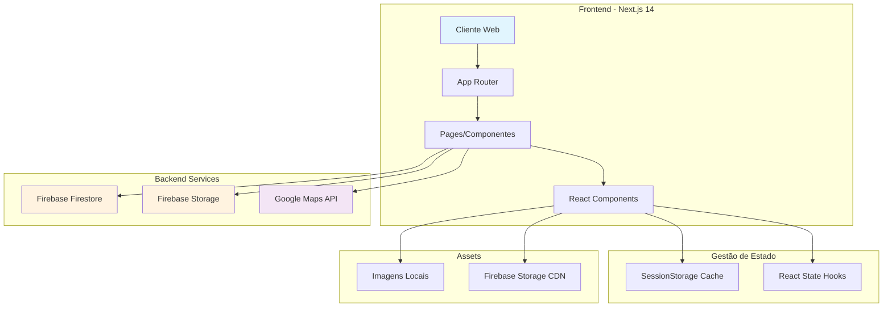
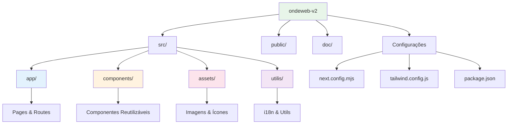
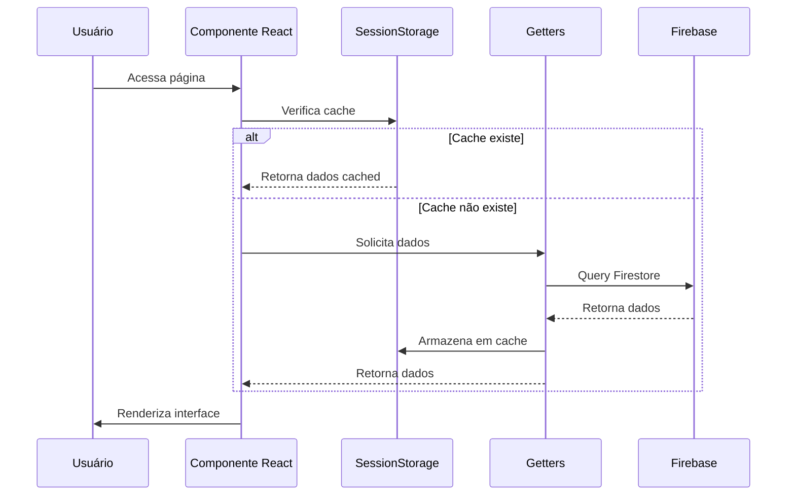
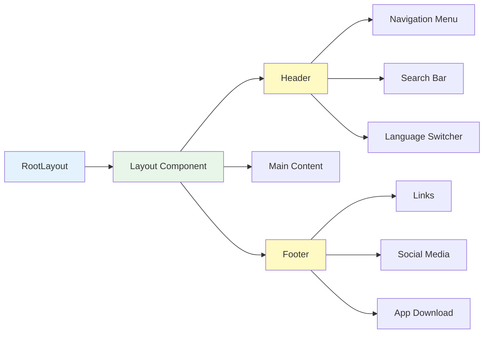
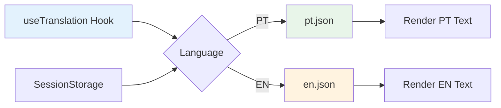
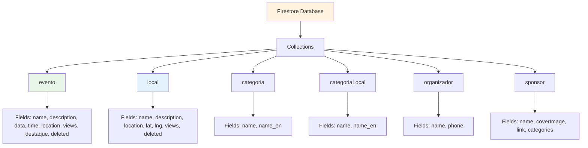
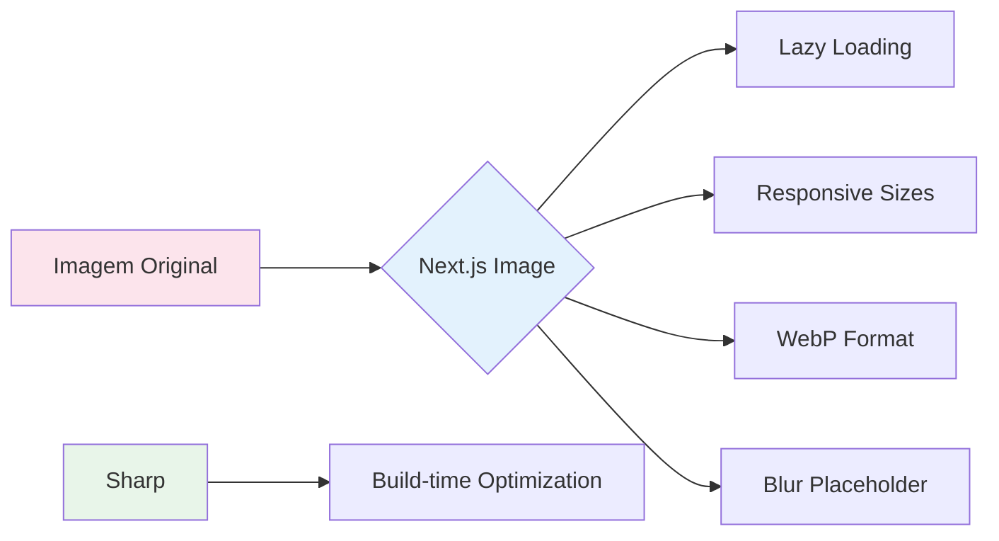
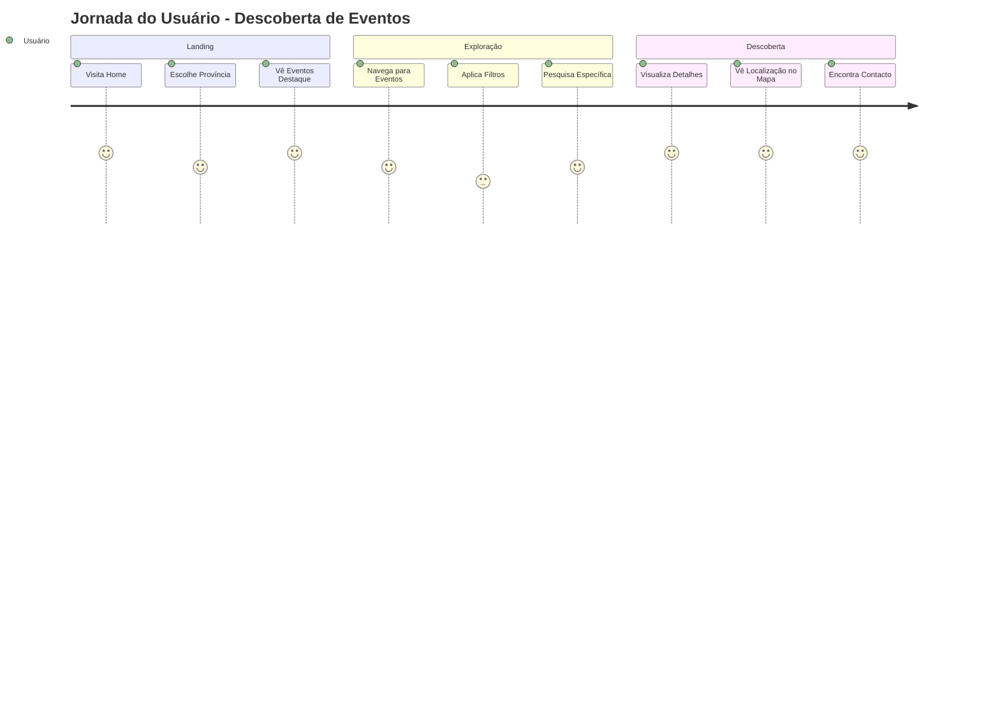

# 📱 Documentação Técnica - Plataforma ONDE Web

## 📋 Índice
1. [Visão Geral](#visão-geral)
2. [Arquitetura do Sistema](#arquitetura-do-sistema)
3. [Estrutura do Projeto](#estrutura-do-projeto)
4. [Stack Tecnológica](#stack-tecnológica)
5. [Fluxo de Dados](#fluxo-de-dados)
6. [Componentes Principais](#componentes-principais)
7. [Sistema de Rotas](#sistema-de-rotas)
8. [Gestão de Estado](#gestão-de-estado)
9. [Internacionalização](#internacionalização)
10. [Integração com Firebase](#integração-com-firebase)
11. [Funcionalidades Principais](#funcionalidades-principais)
12. [Componentes Reutilizáveis](#componentes-reutilizáveis)
13. [Otimizações e Performance](#otimizações-e-performance)
14. [Deployment](#deployment)

---

## 🎯 Visão Geral

**ONDE** é uma plataforma digital de turismo em Moçambique, estruturada como um directório de informação mobile-first, que permite a descoberta de eventos e actividades turísticas através de uma aplicação web integrada a um back-end Firebase com sistema de gestão de conteúdos.

### Objectivos Principais
- 🗺️ Facilitar a descoberta de eventos e locais turísticos em Moçambique
- 📱 Experiência mobile-first optimizada
- 🌍 Suporte multi-idioma (Português e Inglês)
- 🔍 Sistema de pesquisa e filtros avançados
- 📍 Integração com mapas para localização

---

## 🏗️ Arquitetura do Sistema



---

## 📁 Estrutura do Projeto



### Estrutura Detalhada

```
ondeweb-v2/
├── src/
│   ├── app/                    # App Router do Next.js 14
│   │   ├── layout.js           # Layout principal
│   │   ├── page.js             # Home page
│   │   ├── globals.css         # Estilos globais
│   │   ├── eventos/            # Módulo de eventos
│   │   │   ├── page.js         # Lista de eventos
│   │   │   ├── [reference]/    # Detalhe do evento
│   │   │   └── search/         # Pesquisa de eventos
│   │   ├── locais/             # Módulo de locais
│   │   │   ├── page.js         # Lista de locais
│   │   │   ├── [reference]/    # Detalhe do local
│   │   │   └── search/         # Pesquisa de locais
│   │   ├── sobre/              # Página sobre
│   │   └── contactos/          # Página de contactos
│   ├── components/
│   │   ├── layout/             # Componentes de layout
│   │   ├── cards/              # Cards reutilizáveis
│   │   ├── buttons/            # Botões customizados
│   │   ├── getters/            # Funções de busca de dados
│   │   └── css/                # Estilos modulares
│   ├── assets/
│   │   ├── icons/              # Ícones da aplicação
│   │   └── images/             # Imagens estáticas
│   └── utilis/
│       ├── i18n.js             # Configuração i18n
│       ├── pt.json             # Traduções PT
│       └── en.json             # Traduções EN
├── doc/                        # Documentação
└── Configurações              # Config files
```

---

## 💻 Stack Tecnológica

### Frontend Framework
- **Next.js 14.2.14** - Framework React com App Router
- **React 18** - Biblioteca UI
- **Tailwind CSS 3.4** - Framework CSS utility-first

### UI Components & Styling
- **@nextui-org/react** - Componentes UI modernos
- **@mui/material** - Material UI components (Skeleton)
- **Framer Motion** - Animações
- **React Icons** - Biblioteca de ícones

### Integração de Dados
- **Firebase 10.14** - Backend as a Service
  - Firestore - Base de dados NoSQL
  - Storage - Armazenamento de mídia
- **@react-google-maps/api** - Integração com Google Maps

### Funcionalidades Adicionais
- **react-i18next** - Internacionalização
- **Fuse.js** - Pesquisa fuzzy
- **Day.js** - Manipulação de datas
- **Sharp** - Otimização de imagens

---

## 🔄 Fluxo de Dados



### Sistema de Cache

O sistema implementa cache em SessionStorage para:
- **Eventos**: `topEvents`, `popularEvents`, `allEvents`
- **Locais**: `locals`, `localCategories`
- **Categorias**: `eventCategories`, `localCategories`
- **Organizadores**: `organizers`

---

## 🧩 Componentes Principais

### 1. Layout Components



### 2. Páginas Principais

#### Home Page (`src/app/page.js`)
- Banner hero com CTA
- Selector de província
- Filtros temporais (Todos, Hoje, Esta semana, Este mês)
- Secções:
  - Eventos em destaque
  - Eventos populares
  - Organizadores
  - Melhores destinos
  - Lugares em destaque
  - Categorias de lugares

#### Eventos (`src/app/eventos/`)
- Lista de eventos com filtros
- Pesquisa por categoria
- Filtro por localização
- Ordenação (popularidade, A-Z, Z-A)
- Vista responsiva (cards/lista)

#### Locais (`src/app/locais/`)
- Directório de locais turísticos
- Filtros por categoria
- Sistema de pesquisa
- Integração com mapas

### 3. Componentes de Cards

```typescript
// EventCardHr - Card horizontal de evento
{
  coverImage: string,
  name: string,
  data: Timestamp,
  time: string,
  locationName: string,
  organizer: {
    name: string
  }
}

// LocalCardHr - Card horizontal de local
{
  coverImage: string,
  name: string,
  category: Array<{name: string}>,
  location: string
}
```

---

## 🗺️ Sistema de Rotas

```mermaid
graph TD
    A[/] --> B[Home Page]
    A --> C[/eventos]
    A --> D[/locais]
    A --> E[/sobre]
    A --> F[/contactos]
    
    C --> G[/eventos/:reference]
    C --> H[/eventos/search]
    
    D --> I[/locais/:reference]
    D --> J[/locais/search]
    
    style A fill:#e1f5fe
    style C fill:#e8f5e9
    style D fill:#fff3e0
    style G fill:#f3e5f5
    style I fill:#f3e5f5
```

### Rotas Dinâmicas

- **`[reference]`** - Parâmetro dinâmico para ID do evento/local
- **`search`** - Páginas de pesquisa com query params:
  - `name` - Termo de pesquisa
  - `location` - Província selecionada
  - `category` - Categoria filtrada
  - `start_date` / `end_date` - Intervalo de datas (eventos)

---

## 🌐 Internacionalização

### Configuração i18n

```javascript
// src/utilis/i18n.js
i18n.use(initReactI18next).init({
    resources: {
        en: en,  // Inglês
        pt: pt   // Português
    },
    lng: "pt",
    fallbackLng: "pt"
});
```

### Sistema de Tradução



### Implementação

- Hook `useTranslation()` em todos os componentes
- Armazenamento de preferência em SessionStorage
- Switcher no header para troca rápida
- Suporte para categorias bilingues no Firebase

---

## 🔥 Integração com Firebase

### Estrutura de Dados Firestore



### Funções de Busca (Getters)

#### Events Getters (`src/components/getters/events.js`)
- `getEventById(id)` - Busca evento por ID
- `getAllEvents()` - Lista todos os eventos futuros
- `getTopEvents()` - Eventos em destaque
- `getPopularEvents()` - Eventos por visualizações
- `getEventCategories()` - Categorias de eventos
- `getOrganizers()` - Lista organizadores
- `getSponsorsByCategoriesIds()` - Sponsors por categoria

#### Local Getters (`src/components/getters/local.js`)
- `fetchLocalById(id)` - Busca local por ID
- `getBestLocals()` - Locais ordenados por views
- `getLocalCategories()` - Categorias de locais

### Sistema de Views

Incremento automático de visualizações:
```javascript
firebase.firestore()
  .collection('evento')
  .doc(id)
  .update({
    views: firebase.firestore.FieldValue.increment(1)
  });
```

---

## 🎨 Componentes Reutilizáveis

### Botões
```javascript
// ButtonOnde - Botão principal
<ButtonOnde 
  title="Texto do botão"
  onClick={handleClick}
/>
```

### Cards
```javascript
// EventCardHr - Card de evento horizontal
<EventCardHr event={eventData} />

// LocalCardHr - Card de local horizontal
<LocalCardHr local={localData} />

// DestinyCard - Card de destino
<DestinyCard destiny={{name, image}} />

// Organizer - Card de organizador
<Organizer organizer={organizerData} />
```

### Layout
```javascript
// Breadcrumbs personalizados
<Breadcrumbs>
  <BreadcrumbItem href="/">Home</BreadcrumbItem>
  <BreadcrumbItem>Current Page</BreadcrumbItem>
</Breadcrumbs>
```

---

## ⚡ Otimizações e Performance

### 1. Otimização de Imagens



**Configurações:**
- Remote patterns para Firebase Storage
- Sharp para otimização build-time
- Lazy loading automático
- Placeholder blur para melhor UX

### 2. Cache Strategy

```javascript
// Cache em SessionStorage
if (sessionStorage.getItem('events')) {
    return JSON.parse(sessionStorage.getItem('events'))
} else {
    const events = await fetchEvents()
    sessionStorage.setItem('events', JSON.stringify(events))
    return events
}
```

### 3. Code Splitting

- Rotas carregadas sob demanda
- Componentes com `Suspense` para loading states
- Dynamic imports quando necessário

### 4. Performance Features

- **SWC Minification** - Compilação mais rápida
- **Font Optimization** - Fontes locais otimizadas
- **Tailwind Purge** - CSS mínimo em produção
- **React Strict Mode** - Detecção de problemas

---

## 🚀 Deployment

### Configuração de Produção

```javascript
// next.config.mjs
{
    reactStrictMode: true,
    swcMinify: true,
    productionBrowserSourceMaps: true,
    optimizeFonts: true,
    images: {
        remotePatterns: [
            {
                protocol: 'https',
                hostname: 'firebasestorage.googleapis.com'
            }
        ]
    }
}
```

### Variáveis de Ambiente

```bash
# .env.local (gitignored)
NEXT_PUBLIC_GOOGLE_MAPS_API_KEY=xxx
# Firebase config em src/base.js (gitignored)
```

### Build & Deploy

```bash
# Development
npm run dev

# Build para produção
npm run build

# Iniciar servidor produção
npm run start
```

### Plataformas Recomendadas

- **Vercel** - Deploy optimizado para Next.js
- **Firebase Hosting** - Integração nativa com Firebase
- **Netlify** - Alternative com CI/CD

---

## 📊 Métricas e Monitoramento

### Tracking de Views
- Incremento automático em Firestore
- Views por evento/local
- Ordenação por popularidade

### Analytics Potenciais
- Google Analytics integration
- Firebase Analytics
- Custom event tracking

---

## 🔐 Segurança

### Práticas Implementadas

1. **Environment Variables** - Chaves API seguras
2. **Gitignore** - Firebase config excluído do repo
3. **HTTPS Only** - Remote patterns HTTPS
4. **Input Validation** - Validação client-side
5. **XSS Protection** - React escape automático

---

## 📱 Responsividade

### Breakpoints Tailwind

```css
sm: 640px   /* Mobile landscape */
md: 768px   /* Tablet */
lg: 1024px  /* Desktop */
xl: 1280px  /* Large desktop */
```

### Estratégias Mobile-First

- Menu hamburger em mobile
- Cards adaptáveis (horizontal/vertical)
- Filtros em dropdown mobile
- Touch-friendly interfaces
- Imagens otimizadas por viewport

---

## 🔄 Fluxo de Usuário Principal



---

## 🎯 Funcionalidades Chave

### 1. Sistema de Pesquisa
- **Fuzzy Search** com Fuse.js
- Pesquisa em múltiplos campos
- Relevância por score

### 2. Filtros Avançados
- **Localização** - 10 províncias
- **Categorias** - Dinâmicas do Firebase
- **Data** - Hoje, semana, mês, customizado
- **Ordenação** - Popularidade, alfabética

### 3. Integração de Mapas
- Localização exacta de eventos/locais
- Markers personalizados
- Zoom e centro automáticos

### 4. Multi-idioma
- PT/EN switching instantâneo
- Persistência de preferência
- Conteúdo bilingue do Firebase

---

## 🚧 Considerações de Desenvolvimento

### Pontos de Atenção

1. **Firebase Config** - Arquivo `src/base.js` deve ser criado localmente
2. **API Keys** - Google Maps key em `.env.local`
3. **Cache Clear** - SessionStorage pode precisar limpeza manual
4. **Date Handling** - Timestamps Firebase precisam conversão

### Melhorias Sugeridas

1. **Error Handling** - Implementar error boundaries
2. **Loading States** - Skeletons mais granulares
3. **PWA** - Adicionar service workers
4. **SEO** - Meta tags dinâmicas
5. **Testing** - Testes unitários e E2E
6. **Analytics** - Tracking de comportamento

---

## 📞 Suporte e Contacto

**ONDE - Descobrindo Moçambique**
- 📍 Av. Julius Nyerere 657, 2º Andar, Porta 3, Maputo
- 📞 21-486 630
- ✉️ info@onde.co.mz
- 🌐 Desenvolvido por ITCOM

---

## 📄 Licença

© 2024 ITCOM. Todos os direitos reservados.

---

*Última actualização: Dezembro 2024*

